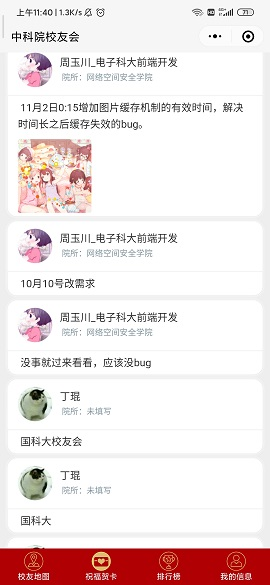
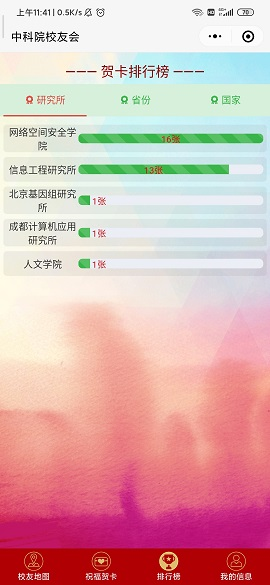
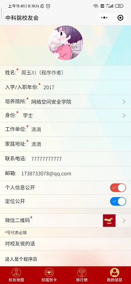

<!-- @format -->

# 中科大校友会

项目介绍：为迎合祖国 70 周年生日，方便中华儿女表达对祖国的祝福，催生出本微信小程序。

# 主要功能：

祝福祖国（文字+图片），证书（canvas），排行（院所，省，国家），校友地图（微信接口获得经纬度+逆地址解析），个人信息（查看别人信息+隐私设置），登陆自动注册（后端使用云开发，json 数据库+图片存储）。

# 云开发 quickstart

云开发的三大基础能

- 数据库：一个既可在小程序前端操作，也能在云函数中读写的 JSON 文档型数据库
- 文件存储：在小程序前端直接上传/下载云端文件，在云开发控制台可视化管理
- 云函数：在云端运行的代码，微信私有协议天然鉴权，开发者只需编写业务逻辑代码
- 参考文档：[云开发文档](https://developers.weixin.qq.com/miniprogram/dev/wxcloud/basis/getting-started.html)

# 主要优化细节

- 使用有效时间缓存机制，缓存基本不会变化的图片
  ```
  getTempImageUrl(file, url) {
    const t = this
    // 获得本地缓存
    const fileInfo = wx.getStorageSync(file)
    let get_net_img = false
    // 缓存存在，而且有效时间存在
    if (fileInfo && fileInfo.filePath && fileInfo.time) {
      console.log(file + "图片存在本地:",fileInfo.filePath);
      let days = Math.ceil(((new Date()).getTime() - fileInfo.time)/(24*3600*1000));
      console.log("距离上一次访问图片相隔时间", days+"day");
      // 缓存超过不新鲜就更新
      (days >= 2) && (get_net_img = true);
      this.globalData[file] = fileInfo.filePath;
    } else {
      get_net_img = true;
    }
    // 更新缓存，请求网络图片
    if (get_net_img) {
      wx.getImageInfo({
        src: url,
        success: res => {
          wx.saveFile({
            tempFilePath: res.path,
            success(res) {
              const saveFilePath = res.savedFilePath
              console.log("缓存图片", file)
              wx.setStorageSync(file, {
                filePath: saveFilePath,
                time: (new Date()).getTime()
              })
              t.globalData[file] = saveFilePath
            }
          })
        },
      })
    }
  },
  ```
- 使用 async/await 控制异步请求流程,有效避免了回调地狱
  ```
  async function prepare(){
      const openid = await t.getOpenid()
      console.log("获得openid", openid)
      t.getUser_info(openid)
    }
    prepare()
  ```

# 页面展示

- 主页 和 活动页面

  ##  

- 展示列表 和 地图页面

  ##  

- 排行 和 个人信息页面

  ##  

- 证书页面
  ## 
